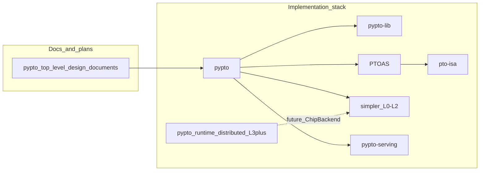

# PyPTO ecosystem monitor

Curated index of **external** GitHub repositories related to PyPTO / PTO / Ascend tooling. This repo exists to **track and document** those projects from my account ([jiashu](https://github.com/jiashu)).

**Policy:** this monitor does **not** modify the listed upstream repositories—no pull requests, issues, tags, releases, or wiki edits are opened on them from this project. See [CONTRIBUTING.md](CONTRIBUTING.md).

The machine-readable list lives in [`manifest.yaml`](manifest.yaml). A periodic workflow refreshes [generated/upstream-snapshot.md](generated/upstream-snapshot.md) with read-only API metadata (stars, default branch, last push). Day-to-day alerts are your choice: see [MONITORING.md](MONITORING.md).

## Tracked repositories

| Upstream | Role / notes | License (see upstream) | Last reviewed |
| -------- | ------------ | ------------------------ | ------------- |
| [hengliao1972/pypto_top_level_design_documents](https://github.com/hengliao1972/pypto_top_level_design_documents) | Top-level design docs | (see upstream) | — |
| [hw-native-sys/pypto](https://github.com/hw-native-sys/pypto) | PyPTO framework (IR, Python API) | CANN Open Software License v2.0 | — |
| [hw-native-sys/simpler](https://github.com/hw-native-sys/simpler) | PTO runtime L0–L2 | (see upstream) | — |
| [hengliao1972/pypto_runtime_distributed](https://github.com/hengliao1972/pypto_runtime_distributed) | Linqu distributed runtime L3+ | (see upstream) | — |
| [zhangstevenunity/PTOAS](https://github.com/zhangstevenunity/PTOAS) | PTO assembler / MLIR toolchain | (see upstream) | — |
| [PTO-ISA/pto-isa](https://github.com/PTO-ISA/pto-isa) | PTO ISA / tile library | CANN Open Software License v2.0 | — |
| [hw-native-sys/pypto-lib](https://github.com/hw-native-sys/pypto-lib) | Tensor-level primitive library design | (see upstream) | — |
| [hengliao1972/pypto-serving](https://github.com/hengliao1972/pypto-serving) | Serving-related experiments / design | (see upstream) | — |

Fill **Last reviewed** manually when you audit upstream, or rely on the auto-generated snapshot timestamps in `generated/upstream-snapshot.md`.

## Ecosystem map (informal)

Relationships are descriptive, not an official architecture diagram.

## GitHub Project

A [GitHub Project](https://docs.github.com/en/issues/planning-and-tracking-with-projects) titled **PyPTO upstream monitor** (under this user) holds draft items—one per upstream repo—for quick notes without touching those repos.

## Related links

- [MONITORING.md](MONITORING.md) — Watch, RSS, and automation scope
- [manifest.yaml](manifest.yaml) — canonical `owner` / `name` / `url` / `category`
